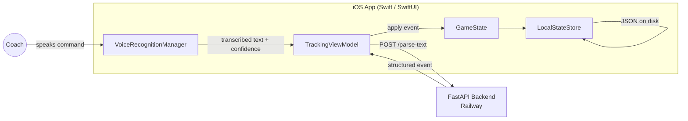
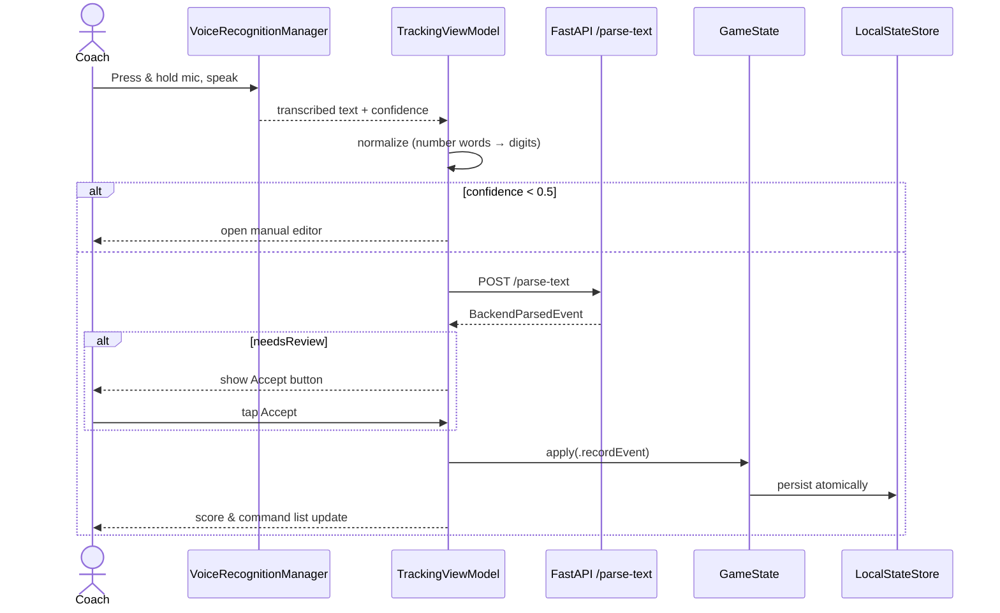

# RallyTrack

> **Voice-driven volleyball stat tracking for live play.**
> A native iOS app that lets coaches record match statistics by speaking short natural-language commands — no taps, no menus, no missed plays.

---

## The Problem

Volleyball moves fast. At every level of the sport, coaches spend a meaningful portion of each match manually recording stats, which pulls their attention away from the players and the game in front of them. Existing solutions are either priced for elite programs or assume a dedicated statistician on the bench — leaving most clubs and high schools stuck with pen-and-paper tracking that is slow, error-prone, and rarely makes it back to the players.

## The Solution

RallyTrack lets a coach press a microphone button, speak a short phrase like **"seven ace"** or **"twelve kill,"** and watch the score update automatically. Speech is transcribed on-device, parsed by a cloud-hosted natural-language service, and committed to local storage as an immutable game event — all in less than a second. The coach's eyes never leave the court.

---

## Key Features

- 🎙 **Hands-free voice input** — press and hold to capture a command, release to submit
- 🧠 **Natural-language parsing** — handles variations like "ace," "service ace," "7 aced it"
- 📶 **Offline-friendly** — speech recognition runs on-device; commands queue when the network is down
- ✅ **Reliability built in** — low-confidence transcriptions open a manual editor; ambiguous parses wait for coach approval
- ↩️ **One-tap undo** — instantly reverse the most recent command
- 🏐 **Full match management** — score tracking, set progression, rotations, lineups, libero rules, and substitutions
- 💾 **Atomic local persistence** — match data is written safely to disk and never lost on a crash
- 📜 **Past match review** — every completed match stays available for read-only viewing

---

## Tech Stack

| Layer | Technology |
|-------|------------|
| iOS Frontend | Swift, SwiftUI, Combine |
| Speech | Apple Speech framework (`SFSpeechRecognizer`), AVFoundation |
| Backend | Python 3.11, FastAPI, Pydantic, Uvicorn |
| Hosting | Railway (Linux container) |
| Persistence | Local JSON via `FileManager` (Application Support directory) |
| Distribution | TestFlight (beta) |

---

## Architecture

RallyTrack is a two-tier system: a native iOS client that handles all user interaction and data storage, and a stateless cloud-hosted backend that performs natural-language parsing.



### Voice Command Flow



---

## Installation

The natural-language parsing backend is already deployed on Railway and shared by every build, so no backend setup is required.

### Option A — TestFlight (End Users)

1. Install **TestFlight** from the App Store.
2. Tap the public TestFlight invitation link from the developer.
3. Tap **Accept** → **Install**.
4. Launch RallyTrack and grant **Microphone** + **Speech Recognition** permissions when prompted.

### Option B — Local Build (Developers)

**Prerequisites:** macOS 14+, Xcode 15+, Git.

```bash
git clone https://github.com/<your-username>/RallyAI.git
cd RallyAI
open RallyAI.xcodeproj
```

In Xcode:

1. Select an iOS Simulator (iPhone 15 Pro or newer running iOS 17+) from the run-destination dropdown.
2. Press **⌘ + R** to build and run.
3. Grant microphone and speech recognition permissions on first launch.
4. Send a test command like `"7 ace"` to verify the backend connection.

All builds (Debug, Release, Simulator, device, TestFlight) point at the live Railway backend, so the app works out of the box.

---

## Project Structure

```
RallyAI/
├── RallyAI/                       # iOS app source
│   ├── RallyAIApp.swift           # App entry point
│   ├── ContentView.swift
│   ├── TrackingViewModel.swift    # Central @MainActor coordinator
│   ├── Models.swift               # Data model types
│   ├── BackendClient.swift        # FastAPI HTTP client (protocol-based)
│   ├── LocalStateStore.swift      # Atomic JSON persistence
│   ├── AppConfig.swift            # Backend URL configuration
│   ├── Domain/
│   │   ├── GameState.swift        # Scoring, events, sets
│   │   ├── GameAction.swift       # Mutation enum (event sourcing)
│   │   ├── RallyEvent.swift       # Immutable recorded event
│   │   └── InGameState.swift      # Court positions, subs, libero rules
│   ├── Voice/
│   │   └── VoiceRecognitionManager.swift  # Speech capture + normalization
│   └── Views/
│       ├── Tracking/              # Live match UI (score, mic, command list)
│       ├── Roster/                # Players, lineup, match history
│       └── Statistics/            # Live + past match stats
└── RallyAI.xcodeproj
```

The companion FastAPI backend lives in a separate repository and is deployed to Railway.

---

## Reliability Features

Voice apps fail when users can't trust them. RallyTrack treats reliability as a first-class feature:

- **Confidence gating** — transcriptions below a 0.5 average confidence threshold open the editor instead of auto-submitting
- **Accept-to-confirm** — when the parser flags a command as ambiguous, the event waits in a review state until the coach taps Accept
- **One-tap undo** — instantly reverse the most recent command without disrupting play
- **Atomic writes** — state is persisted using a write-to-temp-then-rename strategy so a crash mid-match cannot corrupt saved data
- **On-device speech** — transcription continues to function even in gyms with poor connectivity

---

## Roadmap

- 📤 CSV stat export for sharing with players, parents, and recruiters
- ☁️ Multi-device sync so assistants and head coaches can work in tandem
- 🗣 Conversational parsing that handles more natural phrasing variations
- 🎥 Video clip linking that ties recorded events to the corresponding moment of footage
- 🏬 Public App Store release for clubs and high school programs

---

## Author

**Ellie Winter**
Senior Project — California State University, Fullerton

---

## License

This project is distributed under the MIT License. See [LICENSE](LICENSE) for details.
